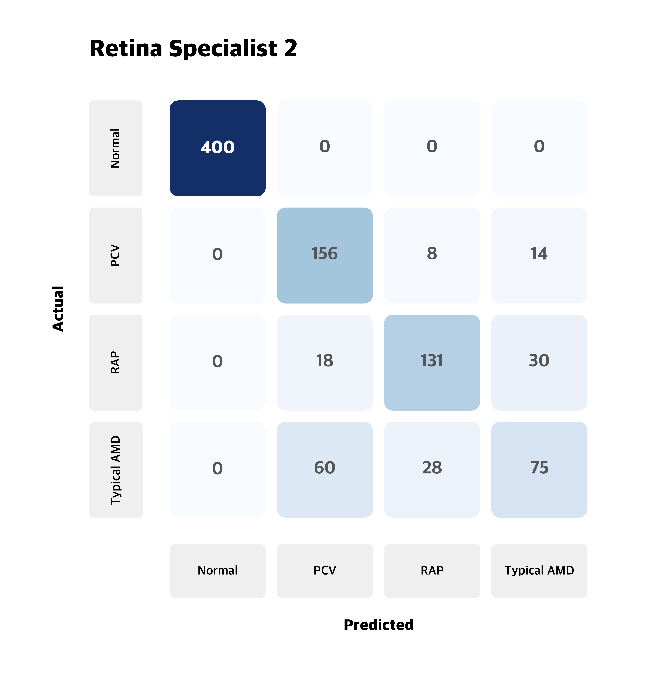
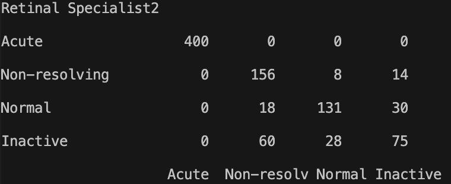

# Pretty Confusion Matrix

## Why pretty confusion matrix?
* We can make confusion matrix by using matplotlib.
* However it is not so pretty. I want to make confusion matrix prettier.

## How to Install?
```python
pip install prettycm
```

## Full Code Example
```python
from prettycm import confusion_matrix
from prettycm import palette

pset = palette(size=5, color="blue")
cm = confusion_matrix([[400,0,0,0],[0,156,8,14],[0,18,131,30],[0,60,28,75]])
cm.set_classname(["Acute", "Non-resolving","Normal","Inactive"])
cm.set_title("Retinal Specialist2")
pset.draw(cm, "place_to_save.png")
```

## Result of generated confusion matrix



## How to Use? Explain more detail
1. import package from prettycm
```python
from prettycm import confusion_matrix
from prettycm import palette
```

2. build confusion matrix object
```python
cm = confusion_matrix([[10,20],[30,3]])
cm.set_classname(["Lion", "Tiger"]) # You can set the class name.
cm.set_title("Lion or Tiger?") # You can set the title.
```
* the input of the confusion_matrix must be two-dimensional array
* You can set the name of the class and title.

3. define palette object
```python
pset = palette(size=5, color="blue")
```
* size = the quality and size of output confusion matrix image
* color = the color of confusion matrix. (Now only blue is supported)

4. draw confusion matrix and save
```python
pset.draw(confusion_matrix=cm, path="place_to_save.png")
```
* confusion_matrix: put confusion matrix object
* path: path to save
#### Done

5. Special function
```python
print(cm)
```
* When you print confusion_matrix object, than python will print the confusion matrix like below



## Update Plans
### 1. More color presets
- [x] Blue
- [ ] Red
- [ ] Green
- [ ] Purple

### 2. Confusion matrix concat
- [ ] Concat two confusion matrix

### 3. Pallet Function
- [ ] Text Size control
- [ ] Cleaning the code